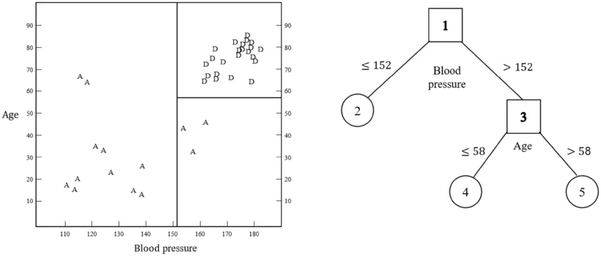

[Click here for the EDA Site!](eda.html)

# Introduction

On the heels of the EDA we performed, we're ready to begin modeling!

Recall that our goal is to predict the potability (safeness to drink) of water based on some measurements about it. In the EDA, we found that the following predictors are most useful:

- `solids`
- `chloramines`
- `conductivity`
- `hardness`
- `ph`
- `turbidity`

## Preparing our Data

Before modeling, we'll prepare our data the same way as in the EDA file.

Additionally, we pare down to just the useful predictors.
```{r}
suppressWarnings(suppressPackageStartupMessages(library(tidyverse)))

water_raw <- read.csv("water_potability.csv")

names(water_raw) <- tolower(names(water_raw))

# preds we identified in EDA step
useful_preds <- c("solids",
                  "chloramines",
                  "conductivity",
                  "hardness",
                  "ph",
                  "turbidity")

# prep dataset
water <-
  water_raw |>
  rename("potable" = "potability",
         "trihalo" = "trihalomethanes") |>
  mutate(potable = factor(potable,
                          labels = c("non_potable", "potable"))) |>
  select(potable, all_of(useful_preds))

# preview
head(water)
```
Looking good! This smaller data set will speed up computations.

We need to be careful though, we included `ph` even though it had some missing observations. 
```{r}
colSums(is.na(water))
```

There are `r sum(is.na(water$ph))` observations with missing `ph` readings. We didn't cover imputation, so it's most prudent to simply remove these observations from the data set:
```{r}
water <-
  water |>
  drop_na()

# no more missing ph values
sum(is.na(water$ph))
```

Now that the data is ready, we can partition our data into a train/test split!

## Train/Test Split + CV Folds

We're told to use a **70/30 train/test split**, so we reserve 70% of the data for model training. I'm including `potable` as the strata so that there's a proportional amount of potable/non-potable water in both partitions.

Also, we split up the training partition into **5 folds** as instructed.

```{r}
suppressWarnings(suppressPackageStartupMessages(library(tidymodels)))

set.seed(558)

# 70/30 train/test split
water_split <- initial_split(water, prop = 0.70, strata = potable)

water_train <- training(water_split)
water_test  <- testing(water_split)

# 5 fold cross validation
water_folds <- vfold_cv(water_train, 5)
```

## Creating a Recipe

Next, we'll make a very simple recipe to add to our workflows.

This is a brief recipe for a few reasons:

- We don't have any dummy variables
- We don't need to normalize our numeric variables for tree-based methods
- We don't need to apply any transformations

Hence, we just specify that our response (potability) is a function of all the predictors in the data set:
```{r}
tree_rec <-
  recipe(potable ~ ., data = water_train)
```

At this point, it's time to work on each model separately!

# Classification Tree Model
## Introduction

A classification tree is a type of tree-based model that attempts to predict the class/group of an observation based on other inputs.

Tree-based models work by splitting the predictor space into regions. The predictor values at which the splits occur are determined by a loss function during the training process. Splits are binary (they form two groups) and recursive (keep happening until stop condition is met). 

In classification, splits are chosen to produce the "purest" possible child nodes. If an observation falls into a region, the model classifies it based on the most common class in that bin.

### A visual Representation of Tree-based Models

On the left hand side of image below, the predictor space is divided into three regions based on the values of `Age` and `Blood Pressure`. The right side of the image shows this representation in tree form.

Consider a person with a blood pressure less than 152. Starting at first node (the box labeled '1'), this person's blood pressure classifies them in the (2) region, corresponding to the larger region on the left side of the predictor space.



## Defining Model + Workflow:

We specify the following details when creating our model:

- Decision tree with a maximum depth of 30, minimum terminal node size of 10, tuneable cost complexity penalty
- Use the `rpart` engine to build a *classification* tree

Regarding our workflow, we simply specify our recipe and the model we just made.
```{r}
# define model
tree_model <-
  decision_tree(tree_depth = 30,
                min_n = 10,
                cost_complexity = tune()) |>
  set_engine("rpart") |>
  set_mode("classification")

# define workflow
tree_wkf <-
  workflow() |>
  add_recipe(tree_rec) |>
  add_model(tree_model)

```

## Fitting the Model

Next, we fit the model to the training folds to optimize the cost-complexity penalty. We will test 25 options to optimize the model performance.

As instructed, we use **log loss** as the loss metric.

```{r}
# fit model to CV folds w/ 15 levels for Cp
tree_fits <-
  tree_wkf |>
  tune_grid(resamples = water_folds,
            grid = grid_regular(cost_complexity(),
                               levels = 25),
            metrics = metric_set(mn_log_loss))

# collect metrics + arrange by loss
tree_fits |>
  collect_metrics() |>
  arrange(mean) |>
  select(cost_complexity, mean)
```

We can see that there's a tie for the best cost complexity parameter. We'll choose the larger penalty, as this will reduce the likelihood our tree over-fits the training data. We can do this using the `select_best()` function:
```{r}
tree_tuned_cp <-
  tree_fits |>
  select_best(metric = "mn_log_loss")

tree_tuned_cp
```

## Finalize Model + Fit Entire Training Set

With our tuning parameter optimized, let's build the final workflow!
```{r}
# finalize workflow
tree_final_wkf <-
  tree_wkf |>
  finalize_workflow(tree_tuned_cp)
```

We'll save the test accuracy for the model showdown.

Next, we build the random forest model!

# Random Forest Model


